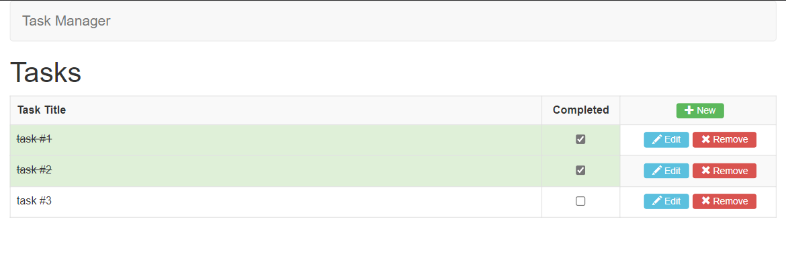

# Task Manager using Angular




> Users can add, edit, remove and list their own tasks.

### Adjusts and improvements

The project is working and it is almost finished:

- [x] List Task Method
- [x] Add Task Method
- [x] Edit Task Method
- [x] Remove Task Method
- [x] Finish README and documentation
- [ ] Unit Tests & Code Coverage

## 💻 Requirements

Before we start, please check it out:

- Node version installed (I used version `v18.14.1`)
- This project can run on any Operating System (Windows/Linux/Mac).

## 🚀 Installing Task Manager

To install Task Manager follow these steps:

```
npm install
```

Then, after finish:

```
npm start
```

## ☕ Using Task Manager

To use Task Manager just access the following link after running the project:
http://localhost:4200/tasks

## 📫 Contributing to Task Manager

To contribute to Task Manager, follow these steps:

1. Fork this repository.
2. Create a branch: `git checkout -b <name_branch>`.
3. Make your changes and confirm it: `git commit -m '<message_commit>'`
4. Send it to the main branch: `git push origin <main> / <local>`
5. Create your Pull Request.

As an alternative, look at GitHub documentation [how to create a Pull Request](https://help.github.com/en/github/collaborating-with-issues-and-pull-requests/creating-a-pull-request).

## 🤝 Collabs

This project was created based on an example of the course [Formação Angular 13 - O início criando 7 projetos](https://www.udemy.com/course/formacao-angular-inicio-criando-7-projetos/) mastered by [Marcio Cesale de Souza](https://www.udemy.com/user/marcio-casale-de-souza/) 

## 📝 License

This project is under the MIT License. See the file [LICENSE](LICENSE) for more details.
